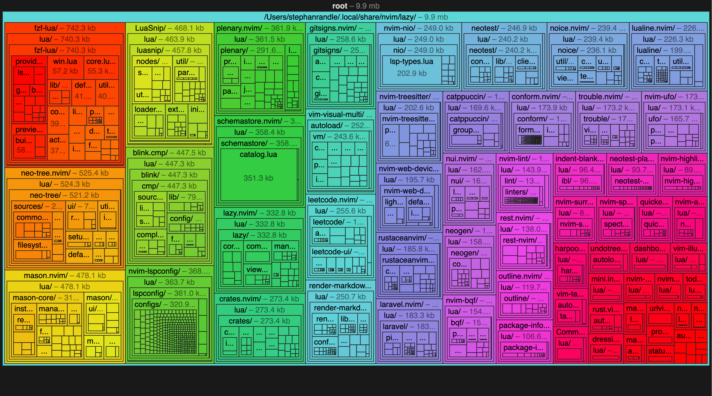

<!-- markdownlint-disable RULE33 -->
# `nvim/`

[Article explaining neovim config](https://madprofessorblog.org/articles/my-neovim-config/)

bundle visualization generated using [bloat.nvim](https://github.com/dundalek/bloat.nvim) and [Esbuild analyzer](https://esbuild.github.io/analyze/)
