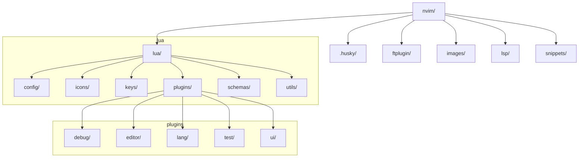

<!-- markdownlint-disable RULE33 MD033 MD041 -->

<div align="center">

# [`@stephansama`](https://github.com/stephansama/stephansama) nvim

[](https://github.com/search?q=repo%3Astephansama%2Fnvim%20language%3Alua&type=code)
[](https://www.lazyvim.org/)
[](https://github.com/search?q=repo%3Astephansama%2Fnvim%20language%3ATypeScript&type=code)
[](https://zod.dev/)

</div>


[Article explaining neovim config](https://madprofessorblog.org/articles/my-neovim-config/)

[interactive bundle visualization](https://files.stephansama.info/configs/neovim)

_bundle visualization generated using [bloat.nvim](https://github.com/dundalek/bloat.nvim) and [Esbuild analyzer](https://esbuild.github.io/analyze/)_

## ⚙️ Installation

Install directly to neovim config with the following command

```sh
git clone https://github.com/stephansama/nvim ~/.config/nvim
```

or install to a specific folder and invoke the config with the following command

```sh
git clone https://github.com/stephansama/nvim ~/.config/stephansamanvim

# then launch neovim with the newly downloaded configuration
NVIM_APPNAME=stephansamanvim nvim
```

## ✨ Features

This Neovim configuration is built to be a highly customized and efficient development environment. Here are some of the key features:

- **📦 Plugin Management**: Uses [`lazy.nvim`](https://github.com/folke/lazy.nvim) for declarative and optimized plugin management, ensuring fast startup times.
- **📝 Schema-Driven Configuration**: Leverages TypeScript and [`zod`](https://zod.dev/) to create and enforce schemas for configuration files like key mappings and dashboard shortcuts. This provides strong typing and validation for what would otherwise be plain JSON or Lua tables.
- **Lua Type-Checking**: Utilizes [`tstl`](https://github.com/TypeScriptToLua/TypeScriptToLua) to generate Lua from TypeScript, enabling robust type-checking and autocompletion for the Lua configuration within the editor.
- **🧩 Modular Structure**: The configuration is broken down into logical modules for plugins, LSP settings, key mappings, and utilities, making it easy to manage and extend.
- **🚀 Built-in Tooling**: Includes scripts for building schemas, syncing snippets, and other automation tasks, managed via `pnpm` and a `Makefile`.

## 📁 File structure


