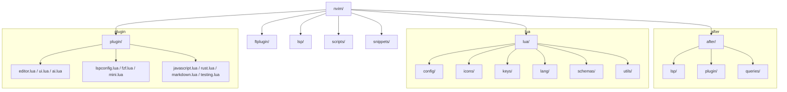

<!-- markdownlint-disable RULE33 MD033 MD041 -->

<div align="center">

# [`@stephansama`](https://github.com/stephansama/stephansama) nvim

[](https://github.com/search?q=repo%3Astephansama%2Fnvim%20language%3Alua&type=code)
[](https://www.lazyvim.org/)
[](https://github.com/search?q=repo%3Astephansama%2Fnvim%20language%3ATypeScript&type=code)
[](https://zod.dev/)

</div>


[Article explaining neovim config](https://madprofessorblog.org/articles/my-neovim-config/)

[interactive bundle visualization](https://files.stephansama.info/configs/neovim)

_bundle visualization generated using [bloat.nvim](https://github.com/dundalek/bloat.nvim) and [Esbuild analyzer](https://esbuild.github.io/analyze/)_

## ⚙️ Installation

Install directly to neovim config with the following command

```sh
git clone https://github.com/stephansama/nvim ~/.config/nvim
```

or install to a specific folder and invoke the config with the following command

```sh
git clone https://github.com/stephansama/nvim ~/.config/stephansamanvim

# then launch neovim with the newly downloaded configuration
NVIM_APPNAME=stephansamanvim nvim
```

## ✨ Features

This Neovim configuration is built to be a highly customized and efficient development environment. Here are some of the key features:

- **📦 Plugin Management**: Uses Neovim 0.12+'s built-in [`vim.pack`](https://neovim.io/doc/user/pack.html) package manager (see [`nvim-pack-lock.json`](./nvim-pack-lock.json) for the lock file). Plugins are declared per-domain under [`plugin/`](./plugin) — e.g. `plugin/editor.lua`, `plugin/ui.lua`, `plugin/ai.lua`.
- **📝 Schema-Driven Configuration**: Leverages TypeScript and [`zod`](https://zod.dev/) to create and enforce schemas for configuration files like key mappings and dashboard shortcuts. This provides strong typing and validation for what would otherwise be plain JSON or Lua tables.
- **Lua Type-Checking**: Utilizes [`tstl`](https://github.com/TypeScriptToLua/TypeScriptToLua) to generate Lua from TypeScript, enabling robust type-checking and autocompletion for the Lua configuration within the editor.
- **🧩 Modular Structure**: The configuration is broken down into logical modules for plugins, LSP settings, key mappings, and utilities, making it easy to manage and extend.
- **🩺 Per-Server LSP Config**: Uses Neovim 0.11+'s `vim.lsp.config` style with one file per server under [`lsp/`](./lsp) (`clangd`, `cssls`, `emmet_language_server`, `gopls`, `jsonls`, `lua_ls`, `tailwindcss`, `yamlls`) and runtime overrides under [`after/lsp/`](./after/lsp).
- **🛠️ Build Pipeline**: TypeScript sources compile to Lua via [`typescript-to-lua`](https://github.com/TypeScriptToLua/TypeScriptToLua); pre-build (`scripts/modes.ts`) and post-build (`scripts/clean.ts`) hooks run automatically on `pnpm run build`.
- **🪝 Quality Gates**: `lefthook` for git hooks, `nano-staged` for pre-commit formatting, `commitlint` (conventional commits), `eslint`, and `prettier` (with `@prettier/plugin-lua`).
- **👀 Watch Mode**: [`bacon.toml`](./bacon.toml) defines watch jobs for `tsc`, lint, fmt, and schema generation, with vim-style keybindings for in-editor monitoring.
- **🚀 Built-in Tooling**: Includes scripts for building schemas, syncing snippets, and other automation tasks, managed via `pnpm` and a `Makefile`.

## 📁 File structure


```mermaid
graph TD
    A["nvim/"] --> B["after/"];
    A --> C["ftplugin/"];
    A --> D["lsp/"];
    A --> E["lua/"];
    A --> F["plugin/"];
    A --> G["scripts/"];
    A --> H["snippets/"];

    subgraph after
        B --> B1["lsp/"];
        B --> B2["plugin/"];
        B --> B3["queries/"];
    end

    subgraph lua
        E --> E1["config/"];
        E --> E2["icons/"];
        E --> E3["keys/"];
        E --> E4["lang/"];
        E --> E5["schemas/"];
        E --> E6["utils/"];
    end

    subgraph plugin
        F --> F1["editor.lua / ui.lua / ai.lua"];
        F --> F2["lspconfig.lua / fzf.lua / mini.lua"];
        F --> F3["javascript.lua / rust.lua / markdown.lua / testing.lua"];
    end
```

## 📚 Schema-driven config

Keymaps, dashboard shortcuts, modes, and language packs are authored as TypeScript [`zod`](https://zod.dev/) schemas under [`lua/schemas/`](./lua/schemas), validated at build time, and emitted as `.json` files alongside their `.lua` consumers under [`lua/keys/`](./lua/keys), [`lua/lang/`](./lua/lang), and [`lua/icons/`](./lua/icons). For example, `lua/keys/global.ts` defines the schema and produces `lua/keys/global.json`, which `lua/keys/global.lua` reads at runtime. This gives every config table a single source of truth with autocomplete and validation, instead of free-form Lua tables.

## 🧰 Development

```sh
make install   # pnpm install (via mise)
make build     # pnpm run build → tstl → scripts/clean.ts
make dev       # tstl --watch
```

- `pnpm run build` runs `tstl -p tsconfig.lua.json` with `scripts/modes.ts` (pre-build) and `scripts/clean.ts` (post-build).
- `bacon` provides editor-driven watch jobs for typecheck, lint, fmt, and schema generation.
- `lefthook` wires pre-commit formatting via `nano-staged`.

<div align="center">

Copyright © 2023-present [`@stephansama`](https://github.com/stephansama)

</div>
